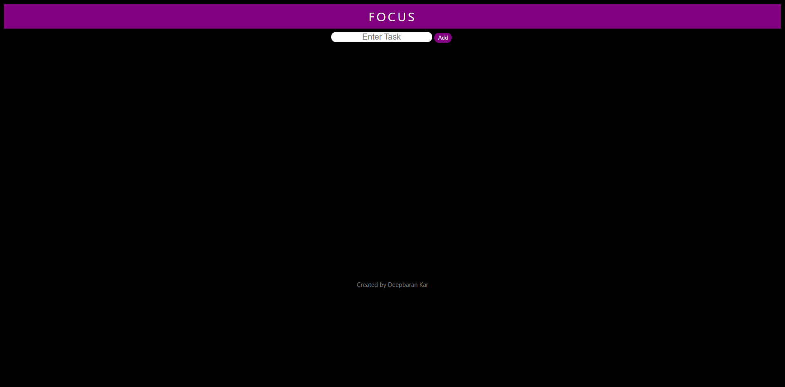
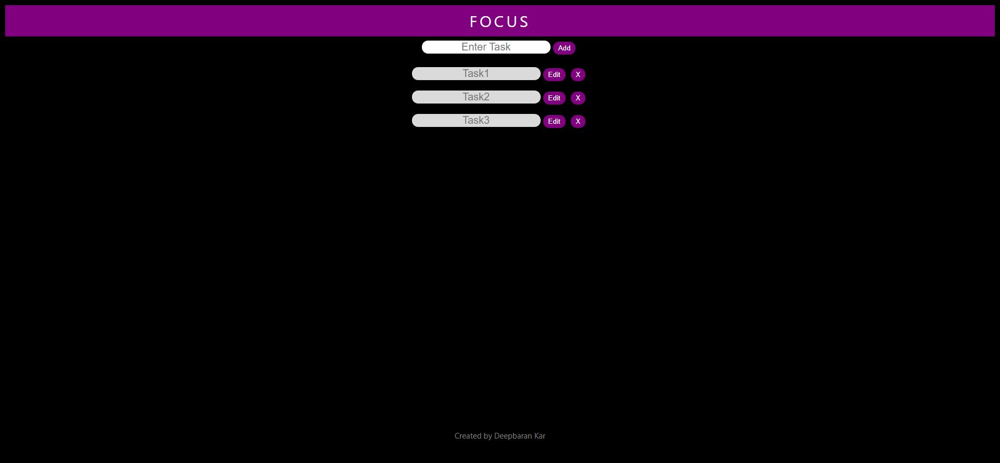
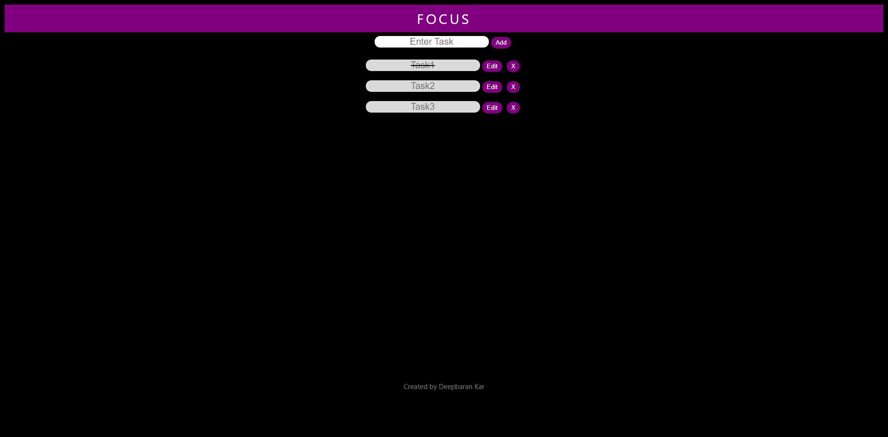
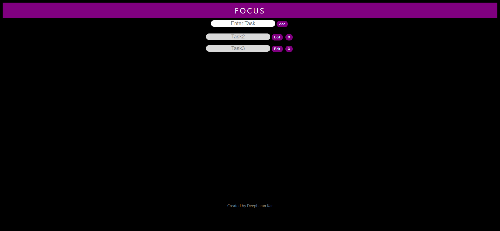

# FOCUS

## Check out the Application Here : [Click Here](https://deepbaran.github.io/Focus/)

### This Web Application will help you focus and organize your work. Never miss important tasks and focus on the important ones.

### This application is built using:

- React.js
- JSX

## Here is how the Application looks like

### How to use:

- Type the task(s) that you want to focus on and press the 'Add' button. And keep adding as many tasks as you need to do.
  
- If you wish to edit a task, just press the 'Edit' button and edit that task. Once done, Press the 'Done' button.
  
- If a task is done, simply click on that task and that task will be crossed out. And if you want to undo it, then simply click on it again.
  
- For deleting any task, simply press the 'X' button.(Tasks cannot be recovered, once deleted. So, make sure you want to delete it)
  

#### Disclaimer:

This application does not use any storage. So, either closing or refreshing the page will cause in data loss.
